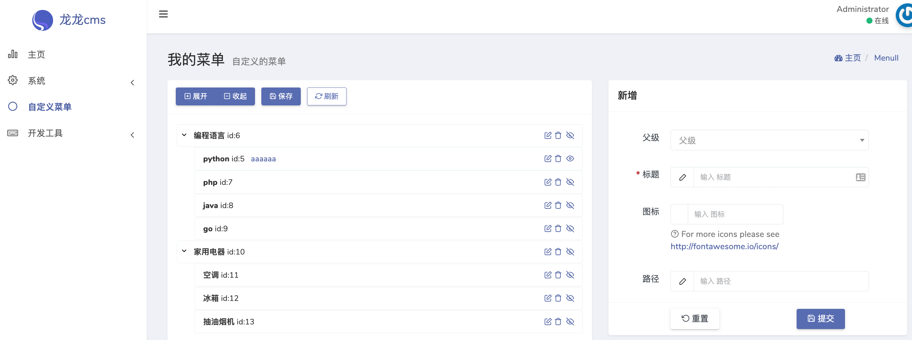

# 自定义菜单 Dcat Admin Extension



# 安装

下载本项目的zip  然后在 `开发工具->扩展` 安装本扩展

# 卸载
把表 `menull`删除即可默认点卸载会删除的 没删掉的话 自行删除


# 创建自定义的菜单

界面在 `/admin/menull`

```php
Route::resource('menull', Controllers\MenullController::class, ['except' => ['create', 'show']]);
```

# 获取菜单数据

```

Route::any('/menull/getMenu', [MenullController::class, 'getMenu']);

```


```php
<?php

namespace App\Http\Controllers;

use Ll\Menull\Models\Menull;
use Illuminate\Http\Request;

class MenullController extends Controller
{
    public function getMenu()
    {
        $menuModel = new Menull;

        return $menuModel->fetchAll();

    }
}

```

```json
[
    {
        "id": 6,
        "parent_id": 0,
        "order": 1,
        "title": "编程语言",
        "icon": null,
        "uri": null,
        "extension": "",
        "show": 1,
        "created_at": "2022-06-04 02:26:30",
        "updated_at": "2022-06-04 02:40:51"
    },
    {
        "id": 5,
        "parent_id": 6,
        "order": 2,
        "title": "python",
        "icon": null,
        "uri": "aaaaaa",
        "extension": "",
        "show": 0,
        "created_at": "2022-06-04 02:26:26",
        "updated_at": "2022-06-04 02:44:48"
    },
    {
        "id": 7,
        "parent_id": 6,
        "order": 3,
        "title": "php",
        "icon": null,
        "uri": null,
        "extension": "",
        "show": 1,
        "created_at": "2022-06-04 02:26:46",
        "updated_at": "2022-06-04 02:40:57"
    },
    {
        "id": 8,
        "parent_id": 6,
        "order": 4,
        "title": "java",
        "icon": null,
        "uri": null,
        "extension": "",
        "show": 1,
        "created_at": "2022-06-04 02:26:52",
        "updated_at": "2022-06-04 02:40:59"
    },
    {
        "id": 9,
        "parent_id": 6,
        "order": 5,
        "title": "go",
        "icon": null,
        "uri": null,
        "extension": "",
        "show": 1,
        "created_at": "2022-06-04 02:26:57",
        "updated_at": "2022-06-04 02:41:01"
    },
    {
        "id": 10,
        "parent_id": 0,
        "order": 6,
        "title": "家用电器",
        "icon": null,
        "uri": null,
        "extension": "",
        "show": 1,
        "created_at": "2022-06-04 02:27:17",
        "updated_at": "2022-06-04 02:41:16"
    },
    {
        "id": 11,
        "parent_id": 10,
        "order": 7,
        "title": "空调",
        "icon": null,
        "uri": null,
        "extension": "",
        "show": 1,
        "created_at": "2022-06-04 02:27:27",
        "updated_at": "2022-06-04 02:41:04"
    },
    {
        "id": 12,
        "parent_id": 10,
        "order": 8,
        "title": "冰箱",
        "icon": null,
        "uri": null,
        "extension": "",
        "show": 1,
        "created_at": "2022-06-04 02:27:33",
        "updated_at": "2022-06-04 02:41:13"
    },
    {
        "id": 13,
        "parent_id": 10,
        "order": 9,
        "title": "抽油烟机",
        "icon": null,
        "uri": null,
        "extension": "",
        "show": 1,
        "created_at": "2022-06-04 02:27:40",
        "updated_at": "2022-06-04 02:41:12"
    }
]
```

# 测试用的sql语句

```sql
SET NAMES utf8mb4;
SET FOREIGN_KEY_CHECKS = 0;

-- ----------------------------
-- Table structure for menull
-- ----------------------------
DROP TABLE IF EXISTS `menull`;
CREATE TABLE `menull` (
  `id` bigint unsigned NOT NULL AUTO_INCREMENT,
  `parent_id` bigint NOT NULL DEFAULT '0',
  `order` int NOT NULL DEFAULT '0',
  `title` varchar(50) COLLATE utf8mb4_unicode_ci NOT NULL,
  `icon` varchar(50) COLLATE utf8mb4_unicode_ci DEFAULT NULL,
  `uri` varchar(50) COLLATE utf8mb4_unicode_ci DEFAULT NULL,
  `extension` varchar(50) COLLATE utf8mb4_unicode_ci NOT NULL DEFAULT '',
  `show` tinyint NOT NULL DEFAULT '1',
  `created_at` timestamp NULL DEFAULT NULL,
  `updated_at` timestamp NULL DEFAULT NULL,
  PRIMARY KEY (`id`)
) ENGINE=InnoDB AUTO_INCREMENT=17 DEFAULT CHARSET=utf8mb4 COLLATE=utf8mb4_unicode_ci;

-- ----------------------------
-- Records of menull
-- ----------------------------
BEGIN;
INSERT INTO `menull` (`id`, `parent_id`, `order`, `title`, `icon`, `uri`, `extension`, `show`, `created_at`, `updated_at`) VALUES (5, 6, 2, 'python', NULL, 'aaaaaa', '', 0, '2022-06-04 02:26:26', '2022-06-04 02:44:48');
INSERT INTO `menull` (`id`, `parent_id`, `order`, `title`, `icon`, `uri`, `extension`, `show`, `created_at`, `updated_at`) VALUES (6, 0, 1, '编程语言', NULL, NULL, '', 1, '2022-06-04 02:26:30', '2022-06-04 02:40:51');
INSERT INTO `menull` (`id`, `parent_id`, `order`, `title`, `icon`, `uri`, `extension`, `show`, `created_at`, `updated_at`) VALUES (7, 6, 3, 'php', NULL, NULL, '', 1, '2022-06-04 02:26:46', '2022-06-04 02:40:57');
INSERT INTO `menull` (`id`, `parent_id`, `order`, `title`, `icon`, `uri`, `extension`, `show`, `created_at`, `updated_at`) VALUES (8, 6, 4, 'java', NULL, NULL, '', 1, '2022-06-04 02:26:52', '2022-06-04 02:40:59');
INSERT INTO `menull` (`id`, `parent_id`, `order`, `title`, `icon`, `uri`, `extension`, `show`, `created_at`, `updated_at`) VALUES (9, 6, 5, 'go', NULL, NULL, '', 1, '2022-06-04 02:26:57', '2022-06-04 03:59:04');
INSERT INTO `menull` (`id`, `parent_id`, `order`, `title`, `icon`, `uri`, `extension`, `show`, `created_at`, `updated_at`) VALUES (10, 0, 6, '家用电器', NULL, NULL, '', 1, '2022-06-04 02:27:17', '2022-06-04 02:41:16');
INSERT INTO `menull` (`id`, `parent_id`, `order`, `title`, `icon`, `uri`, `extension`, `show`, `created_at`, `updated_at`) VALUES (11, 10, 7, '空调', NULL, NULL, '', 1, '2022-06-04 02:27:27', '2022-06-04 02:41:04');
INSERT INTO `menull` (`id`, `parent_id`, `order`, `title`, `icon`, `uri`, `extension`, `show`, `created_at`, `updated_at`) VALUES (12, 10, 8, '冰箱', NULL, NULL, '', 1, '2022-06-04 02:27:33', '2022-06-04 02:41:13');
INSERT INTO `menull` (`id`, `parent_id`, `order`, `title`, `icon`, `uri`, `extension`, `show`, `created_at`, `updated_at`) VALUES (13, 10, 9, '抽油烟机', NULL, NULL, '', 1, '2022-06-04 02:27:40', '2022-06-04 02:41:12');
COMMIT;

SET FOREIGN_KEY_CHECKS = 1;
```
